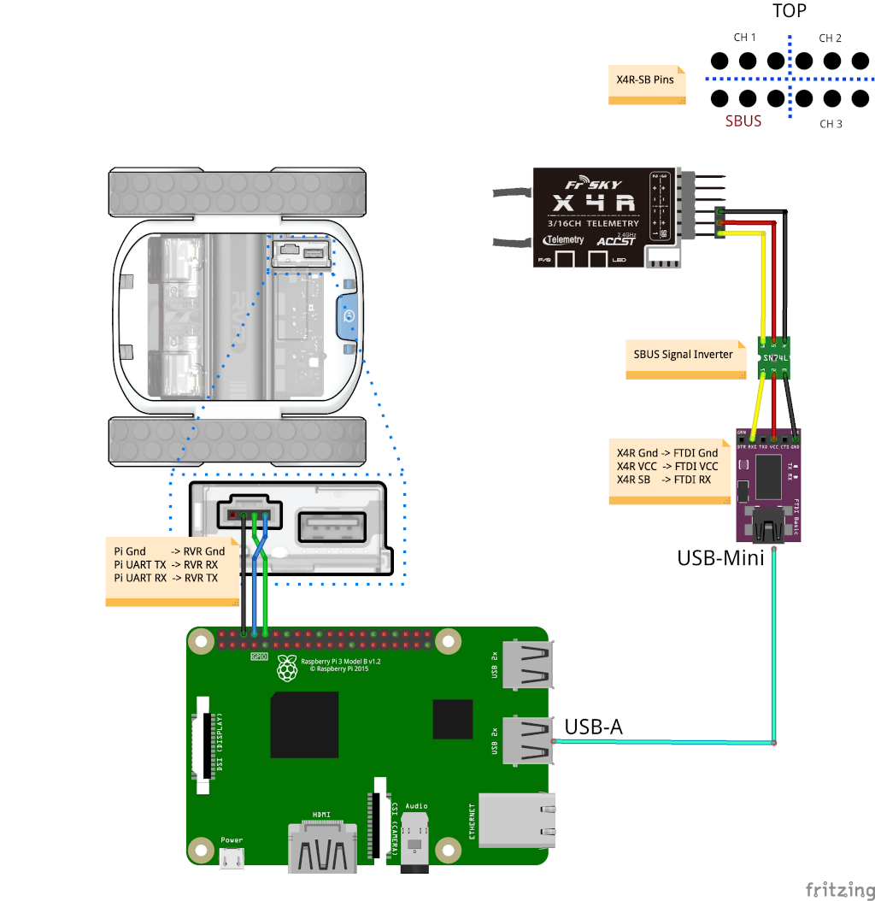

# RC RVR

This project allows a user to integrate a third-party 2.4Ghz RC receiver with RVR, and control it with any transmitter
it can be paired to.

#### Project Materials:
- RVR
- Raspberry-pi 3 or 3B+
- 5v FTDI Basic
- USB-A to USB-Mini cable
- FRSky Taranis 9XD
- FRSky X4R-SB 2.4Ghz Receiver w/ SBUS support 
- SBUS Signal Inverter Cable

**Note about receivers and transmitters:**\
While this project was developed using the receiver and transmitter stated earlier, it should be possible to 
use other receiver/transmitter combinations, as long as the receiver supports the SBUS protocol. 

#### Pairing the transmitter and receiver:
There are plenty of online resources to help with pairing X4R-SB with the Taranis 9XD.  Here's a 
recommended [link](https://www.propwashed.com/how-to-bind-taranis/).  If you have acquired other components, be sure to look up their pairing procedure.

#### Wiring Diagram:


##### **Important: Please ensure your transmitter and receiver are both on and paired before continuing.**

#### Running the program:
The use of the FTDI UART to USB adpater is required since the Raspberry-Pi's UART pins are already occupied by the connection
to RVR. To determine the which port FTDI is on, be sure to plugin in the FTDI to one of the Pi's available USB Ports.
Then, run the following command from the Pi's terminal:

```ls /dev/ttyUSB*```

This will print something like ```/dev/ttyUSB0```. If you need to have other USB peripherals connected (e.g. a keyboard and mouse) 
in addition to the FTDI, try running the command before plugging the FTDI in, and run it again after to notice which new port
has been added, and take note of it.  You will need it as an argument when running the python script. 

You can choose to run either the asyncio version of the program ```rc_asyncio_rvr.py```, or the observer version ```rc_observer_rvr.py```.
They perform the same, and are meant to provide an example of the same functionality using both versions of the SDK.

In addition to providing the FTDI port as an argument, you will also need to provide a baud rate.\
The format of the command is as follows:
```python <program_script> <port> <baudrate>```


If you decide to run the observer script, the command looks like this, assuming your FTDI port is ```/dev/ttyUSB0```:\
```python rc_observer_rvr.py /dev/ttyUSB0 96666```

Note the non-standard baud rate of ```96666```. This value was reached through trial and error, and was based on an issue raised
in the comments section of [this forum post](https://os.mbed.com/users/Digixx/notebook/futaba-s-bus-controlled-by-mbed/).
The [original project](https://github.com/1arthur1/PiSBUS) recommends a baud rate ```100000```  when connecting to the Pi's
UART pins. The commenter notes that a rate of ```98000``` seemed to worked better, and when connecting through USB port, 
we noticed the rate needed to lowered again to produce an error free data stream.

#### Autostarting the program:

If you'd like the program automatically start up when the Pi boots up, then you must configure the Pi to run the `autostart_rc_rvr.sh` 
shell script.  

- Open the `autostart_rc_rvr.sh` shell script. 
```
cd <your-repo-path-here>
python rc_asyncio_rvr.py <usb-port-here-in-quotes> 96666
#scrot
```

- Add the path to your local repo directory.  For example, if it's under  `/home/pi/rc-rvr`, then the command will be `cd rc-rvr`.
Next, add the USB port you'd like to access here in quotes (e.g. "/dev/ttyUSB0"). This is the same port discovered in the section
"Running the program."  It is not necessary to uncomment the `scrot` command, since it's meant for troubleshooting, and 
explained in the last step of this section.
```
cd rc-rvr
python rc_asyncio_rvr.py "/dev/ttyUSB0" 96666
#scrot
```

- Make the `autostart_rc_rvr.sh` executable by running the `chmod` command with the `+x` flag:
```
pi@rvr-pi:~/rc-rvr $ chmod +x autostart_rc_rvr.sh
```

-  Now that the shell script is configured, navigate to the root directory of your Pi:
```
pi@rvr-pi:~/rc-rvr $ cd ..
pi@rvr-pi:~ $ cd ..
pi@rvr-pi:/home $ cd ..
pi@rvr-pi:/ $  
```

 - Navigate to the `LXDE-pi` directory:
```
pi@rvr-pi:/ $ cd etc/xdg/lxsession/LXDE-pi
pi@rvr-pi:/etc/xdg/lxsession/LXDE-pi $
``` 

- Edit the autostart file as a super user:
```
pi@rvr-pi:/etc/xdg/lxsession/LXDE-pi $ sudo nano autostart 
```

- You will see the contents of the file:
```
GNU nano 2.7.4  

@lxpanel --profile LXDE-pi
@pcmanfm --desktop --profile LXDE-pi
@xscreensaver -no-splash
point-rpi
```

- You will need to provide the absolute path to the `autostart_rc_rvr.sh` shell script contained within your local repo directory.
For example, if you cloned it to `/home/pi/rc-rvr`, then you'll create a new line above `@xscreensaver -no-splash`,
and type in the following command:

```
GNU nano 2.7.4  

@lxpanel --profile LXDE-pi
@pcmanfm --desktop --profile LXDE-pi
@lxterminal -e /home/pi/rc-rvr/autostart_rc_rvr.sh
@xscreensaver -no-splash
point-rpi
```
- The `@lxterminal -e` command launches a terminal window at startup, in which the shell script at the specified path will be executed.
Once, the line is entered, press `CTRL+X` to bring up the save menu, and then press `Y` to save the changes.  Then press `Enter` to exit nano.

- To test the autostart feature, reboot the pi:
```
pi@rvr-pi:/etc/xdg/lxsession/LXDE-pi $ sudo reboot
```

- After approximately 10-15 seconds, you should see RVR's LEDs turn green.  This means RVR is ready, and you should now
be able to operate RVR with your RC Transmitter.  If it does not turn green, be sure to check that you have specified your 
USB port correctly in the `autostart_rc_rvr.sh` script, and that you've specified the correct path to the shell script in the autostart
script in `/etc/xdg/lxsession/LXDE-pi` directory.

- If you continue experiencing issues, you can also capture a screenshot of the terminal window if you uncomment the `scrot` 
command in the `autostart_rc_rvr.py` shell script. The terminal window that launches at startup automatically closes if 
it encounters an error.  This will allow you to see the error message being generated.

