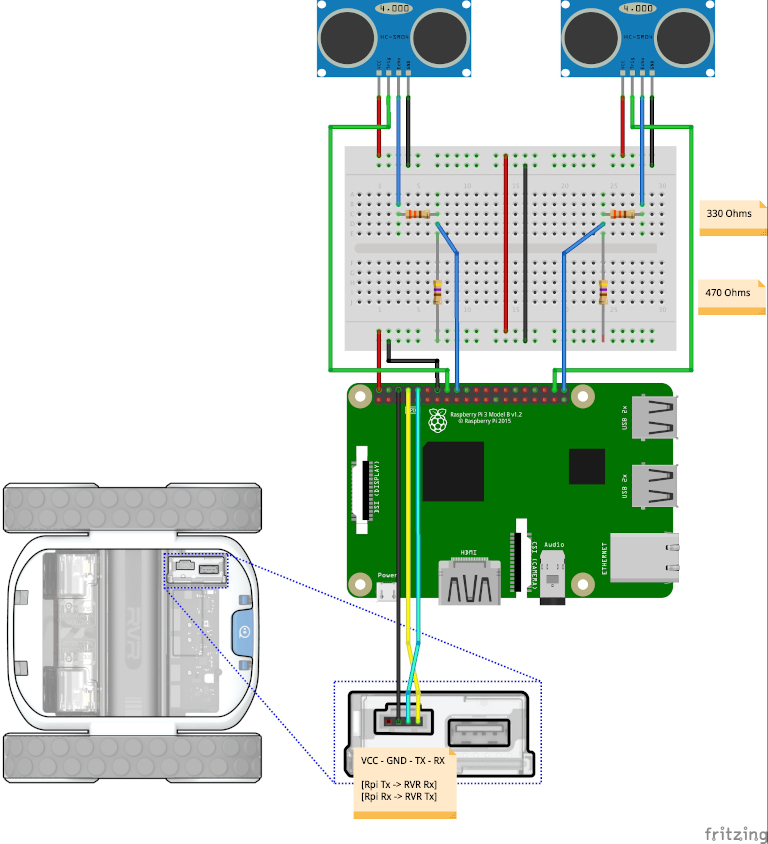
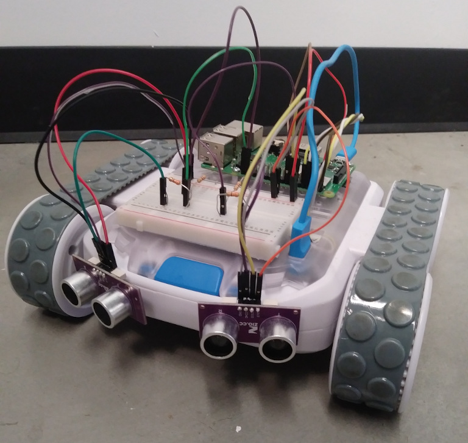

# Ultrasonic RVR

#### This project turns RVR into an autonomously driving robot that avoids collisions with walls and other objects.

Project materials:
- One RVR
- Two HC-SR04 sensors
- Two 330 Ohm resistors
- Two 470 Ohm resistors
- One 400-pin breadboard
- Two male-male breadboard cables
- Five female-female breadboard cables
- Ten female-male breadboard cables

#### Wiring Diagram:
`Note:` The HC-SR04 ultrasonic range finder is very simple to use, however the signal it outputs needs to be converted\
from 5V to 3.3V so as not to damage the Raspberry Pi.  Hence, the need for resistors.




The code is already configured to use the pins specified in the diagram. However, if you'd like to use other pins,\
please be sure to up date the pin assignments in the pin declarations.

```
right_trigger = 20
right_echo = 21
left_trigger = 23
left_echo = 24
```

For a complete reference of the pin layout on a Raspberry-pi 3, see [here](https://pinout.xyz/).

#### Mounting Suggestion (Your design can be much prettier):
